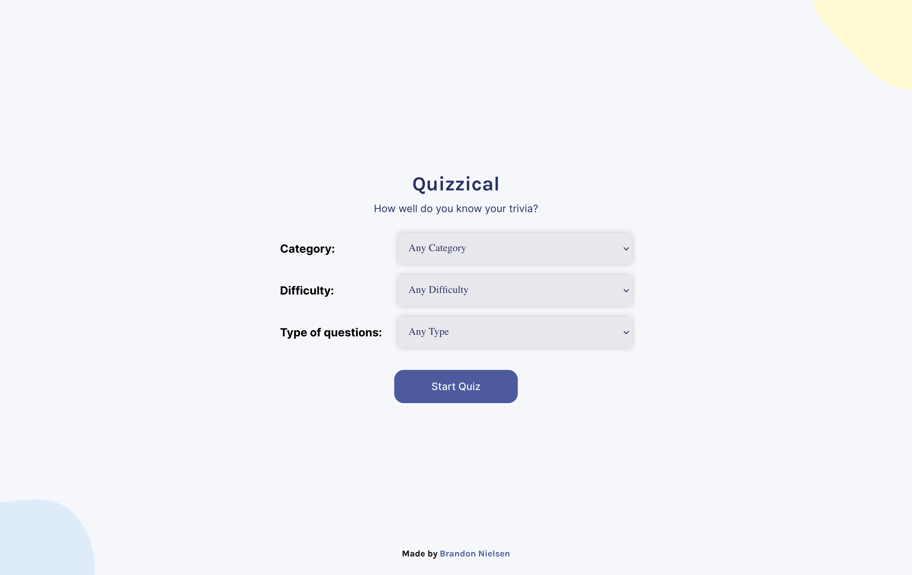
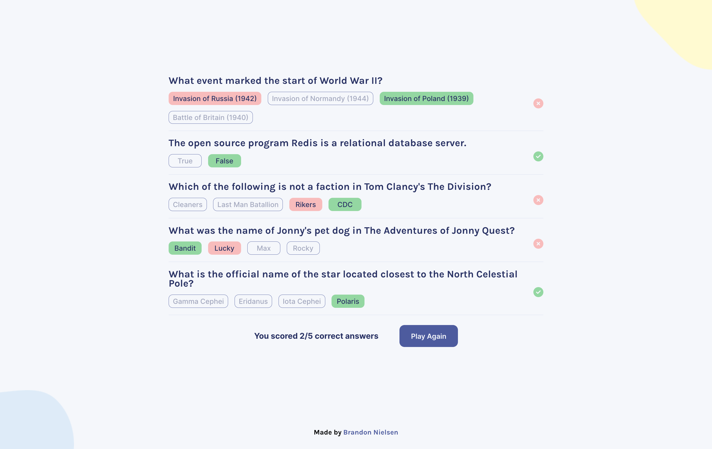
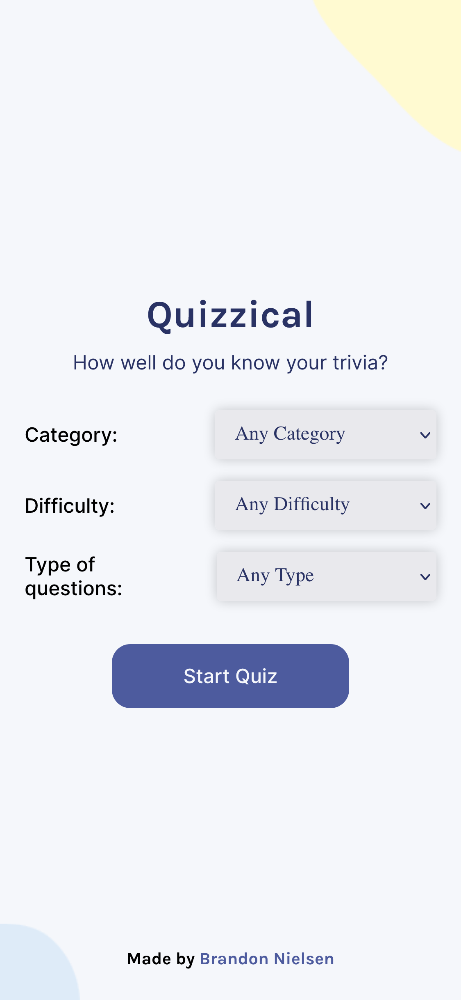
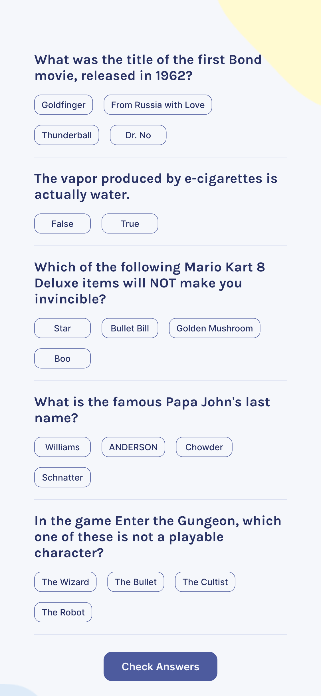
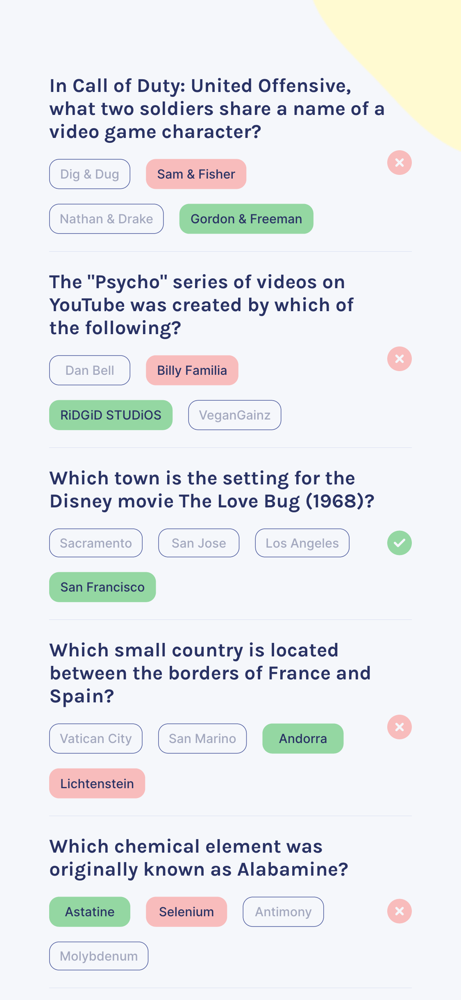

# Quizzical

#### A quiz app that gets data from The Open Trivia Database API

## Table of Contents

- [Overview](#overview)
  - [Screenshots](#screenshots)
  - [Link](#link)
- [My process](#my-process)
  - [Built with](#built-with)
  - [Continued development](#continued-development)
  - [Useful resources](#useful-resources)
- [Author](#author)

## Overview

### Screenshots

#### Desktop

#### Mobile

   

### Link

- Live Site URL: [https://bnielsencodes.github.io/quizzical](https://bnielsencodes.github.io/quizzical)

## My Process

### Built with

- [React](https://reactjs.org/) - JS library
- [Create React App](https://create-react-app.dev/) - React Build Tool
- [Fetch API](https://developer.mozilla.org/en-US/docs/Web/API/Fetch_API)
- [CSS Flexbox](https://developer.mozilla.org/en-US/docs/Learn/CSS/CSS_layout/Flexbox)
- [Semantic HTML5 markup](https://www.w3schools.com/html/html5_semantic_elements.asp)
- [Mobile-first workflow](https://developer.mozilla.org/en-US/docs/Learn/CSS/CSS_layout/Responsive_Design)
- [VS Code](https://code.visualstudio.com/) - Integrated development environment

### Continued development

- Add confetti on 5/5 questions scored correctly

### Useful Resources

- Font Awesome for correct/incorrect icons - [Font Awesome](https://www.fontawesome.com)

## Author

- Portfolio Website - [bnielsen.dev](https://bnielsen.dev)
- LinkedIn - [/in/bnielsencodes](https://linkedin.com/in/bnielsencodes)
- Twitter - [@bnielsencodes](https://twitter.com/bnielsencodes)
- Frontend Mentor - [@bnielsencodes](https://www.frontendmentor.io/profile/bnielsencodes)
