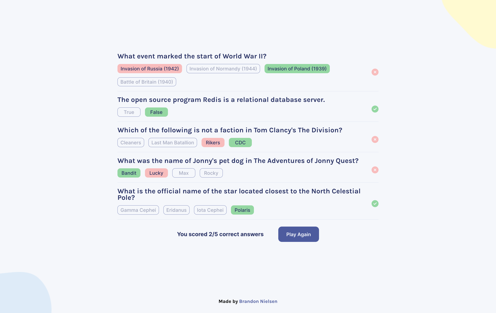

# Quizzical - A quiz app that gets data from The Open Trivia Database API

## Table of Contents

- [Overview](#overview)
  - [Screenshots](#screenshots)
  - [Links](#links)
- [My process](#my-process)
  - [Built with](#built-with)
  - [Continued development](#continued-development)
  - [Useful resources](#useful-resources)
- [Author](#author)

## Overview

### Screenshots

#### Desktop

#### Mobile

  

### Links

- Solution URL: [https://github.com/bnielsencodes/quizzical](https://github.com/bnielsencodes/quizzical)
- Live Site URL: [https://bnielsen.dev/quizzical](https://bnielsen.dev/quizzical)

## My Process

### Built with

- React
- Create React App
- Semantic HTML5 markup
- Flexbox
- Mobile-first workflow

### Continued development

- ~~Add the ability to choose between categories, levels of difficulty, and types of questions~~
- Add confetti on 5/5 questions scored correctly

### Useful Resources

- Font Awesome for correct/incorrect icons - [Font Awesome](https://www.fontawesome.com)

## Author

- Website - [Brandon Nielsen](https://www.bnielsen.dev)
- LinkedIn - [Brandon Nielsen](https://www.linkedin.com/in/bnielsencodes)
- Twitter - [@bnielsencodes](https://twitter.com/bnielsencodes)
- Frontend Mentor - [@bnielsencodes](https://www.frontendmentor.io/profile/bnielsencodes)
